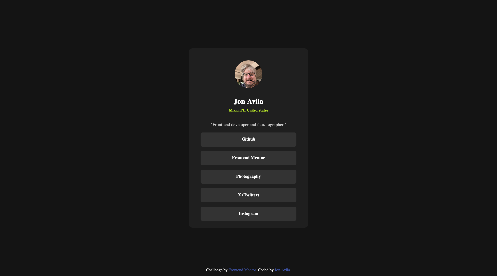

# Frontend Mentor - Social links profile solution

This is a solution to the [Social links profile challenge on Frontend Mentor](https://www.frontendmentor.io/challenges/social-links-profile-UG32l9m6dQ). Frontend Mentor challenges help you improve your coding skills by building realistic projects.

## Table of contents

- [Overview](#overview)
  - [The challenge](#the-challenge)
  - [Screenshot](#screenshot)
  - [Links](#links)
- [My process](#my-process)
  - [Built with](#built-with)
  - [What I learned](#what-i-learned)
- [Author](#author)

## Overview

### The challenge

Users should be able to:

- See hover and focus states for all interactive elements on the page

### Screenshot

### Links

- Live Site URL: [https://madroosterlab.github.io/FEM-SocialLinks/](https://madroosterlab.github.io/FEM-SocialLinks)

## My process

### Built with

- Semantic HTML5 markup
- Flexbox

### What I learned

I learned that I can style anchor elements as buttons.

## Author

- Jon Avila
- Frontend Mentor - [@madroosterlab](https://www.frontendmentor.io/profile/madroosterlab)
